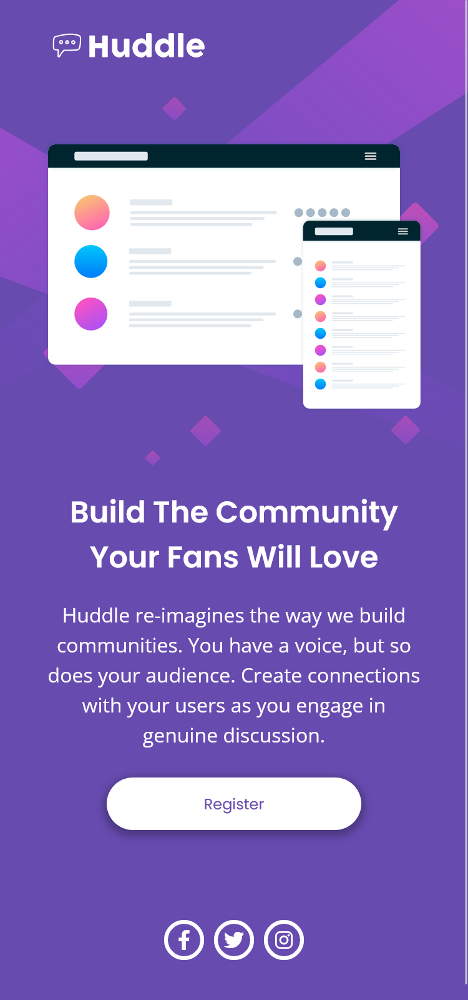

# Frontend Mentor - Huddle landing page with single introductory section solution

This is a solution to the [Huddle landing page with single introductory section challenge on Frontend Mentor](https://www.frontendmentor.io/challenges/huddle-landing-page-with-a-single-introductory-section-B_2Wvxgi0). Frontend Mentor challenges help you improve your coding skills by building realistic projects.

## Table of contents

- [Overview](#overview)
  - [The challenge](#the-challenge)
  - [Screenshot](#screenshot)
  - [Links](#links)
- [My process](#my-process)
  - [Analysis](#analysis)
  - [Built with](#built-with)
  - [What I learned](#what-i-learned)
  - [Continued development](#continued-development)
  - [Useful resources](#useful-resources)
- [Author](#author)

## Overview

### The challenge

Users should be able to:

- View the optimal layout for the page depending on their device's screen size
- See hover states for all interactive elements on the page

### Screenshot

### Links

- Solution URL: [Project on GitHub](https://github.com/joanFaseDev/hudle-landing-page)
- Live Site URL: [Project hosted through Vercel](https://hudle-landing-page-ten.vercel.app/)

## My process

### Analysis

- There's two designs for this project, mobile and desktop, so we need to make the page responsive.

- Use a _main_ element as a global container then nest a _div_ inside with a _width_ in percentage, that way no padding is needed.

- Then create two _section_ elements, each with a _h2_ heading. The first will contain the Huddle part with the illustration. The second will contain the Community part with the link and social media logos.

- The Register button is used as a link so we need an _a_ element with lots of styling (also there's an active part to style).

- We'll probably use CSS Grid on the desktop design, two columns will do for a nice layout.

- The image's background change between the mobile design and the desktop one. Maybe use _picture_ and _source_ elements to change the image through media queries.

### Built with

- Semantic HTML5 markup
- CSS custom properties
- Flexbox
- CSS Grid

### What I learned

- I got acquainted with the Font Awesome API. I just read through the basics but it looks fun and quite easy to implement. I could only use the free assets though so i couldn't totally replicate the mockup design. That being said i like the design i ended up with so that's ok.

- I was made painfully aware of the fact that i'm still far from having a 'decent' level with CSS Grid. I ended up losing a lot of time because i forgot that the grid layout only apply to direct childs of the container.

### Continued development

- I need to keep working on Flexbox, CSS Grid and responsive layout. The way i handle transition from mobile to desktop design is far from satisfying and i feel that it's going to bite me in the back in a not-so-far future.

### Useful resources

- [Font Awesome - Bordered & Pulled Icons](https://fontawesome.com/docs/web/style/pull) - This helped me set up a proper border for the social media's icons.
- [Font Awesome - Customizing Icons](https://fontawesome.com/docs/web/style/custom) - This helped me using CSS custom properties targeting specifically the social media's icons
- [Easings.net](https://easings.net/) - A cool website i often used to copy/paste easing functions. Works wonder with the CSS _transition_ property (specifically for the property _transition-timing-function_)

## Author

- Frontend Mentor - [@joanFaseDev](https://www.frontendmentor.io/profile/joanFaseDev)
